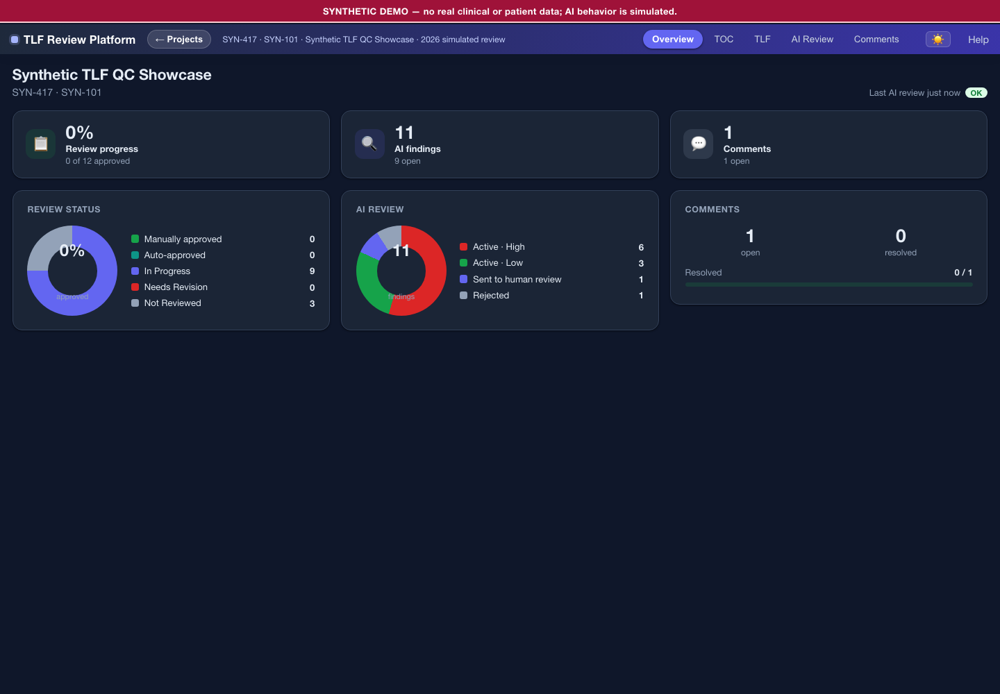
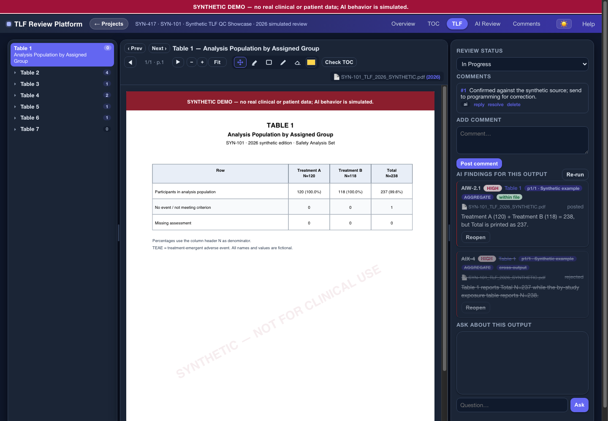
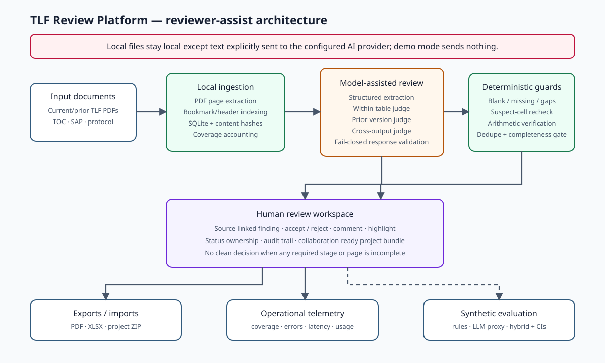
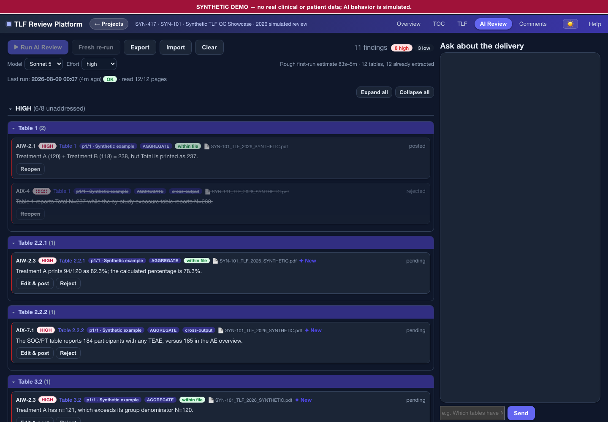
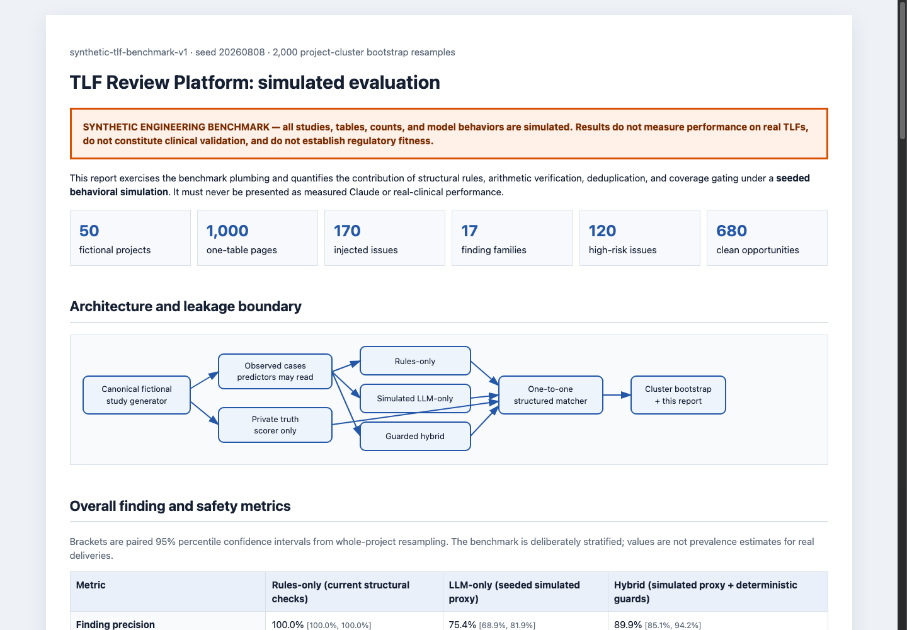

# AI-Assisted Clinical TLF Review Platform

A human-in-the-loop quality-control prototype for clinical tables, listings, and figures (TLFs), with automation currently focused on tables. It combines deterministic document checks, structured LLM review, prior-version comparison, and reviewer adjudication in one auditable workspace.

> **Synthetic portfolio demonstration:** every document, study identifier, count, finding, screenshot, and evaluation label in this repository is fictional. Model behavior in the one-click demo and benchmark is simulated.

> **License:** original project code and synthetic portfolio materials are MIT-licensed; third-party components retain their own licenses.



[Watch the two-minute walkthrough](docs/media/tlf-review-demo.mp4) · [Read the simulated evaluation report](evaluation/REPORT.md) · [Read the setup guide](SETUP.md)

## My contribution

**Role: sole developer.** Drawing on workflow needs observed during an internship, I independently defined the product, architecture, implementation, testing, and validation boundaries for the prototype; it was not commissioned or assigned as an employer work product.

I designed and built:

- the FastAPI/SQLite application and browser interface;
- PDF ingestion, bookmark/header reconciliation, and table-level navigation;
- a hybrid review pipeline covering structured extraction, within-table review, prior-version comparison, cross-output checks, arithmetic verification, deduplication, and coverage gating;
- reviewer workflows for source-linked findings, accept/reject/reopen decisions, statuses, comments, PDF annotations, and audit history;
- PDF, XLSX, and portable project-bundle import/export;
- fail-closed handling for malformed model output, incomplete extraction, unavailable AI phases, stale automatic approvals, and overlapping review runs;
- an isolated synthetic demo, reproducible evaluation harness, automated tests, CI, dependency auditing, Docker packaging, and public-content safeguards.

## What is implemented and what is simulated

| Area | Evidence in this repository | Claim boundary |
|---|---|---|
| Local review application | Source modules, browser UI, generated demo, and application tests | Implemented as a local, single-user prototype; not a production or regulated system |
| Deterministic checks and reviewer workflow | `checks.py`, `runner.py`, persistence/import/export modules, and `tests/` | Tested against generated fixtures; not shown to be comprehensive on real deliveries |
| Optional model-backed review and chat | `ai_client.py`, `ai_review.py`, and `chat.py` | Invokes an Anthropic-compatible API through the Python SDK only when source mode has a user-supplied key; it is disabled in the synthetic demo |
| One-click demonstration | `demo/run_demo.py`, screenshots, and the walkthrough video | Uses pre-seeded finding records and generated PDFs; it does not call or measure an external model |
| Evaluation results | `evaluation/` generator, scorer, tests, and checked artifacts | Compare deterministic rules with seeded model-behavior simulators; they are not Claude or clinical-performance measurements |

## The problem and workflow

TLF deliveries can contain many dense, interdependent tables. Manual review is necessary, but repetitive checks are slow; an LLM-only workflow can miss content, misread numbers, or perform incorrect arithmetic. This prototype treats model output as review candidates rather than confirmed errors:

1. Upload a current TLF PDF and, optionally, a prior edition and reference PDFs.
2. Index tables from PDF bookmarks and printed headers.
3. Run deterministic structural checks for blank pages, missing outputs, and numbering gaps.
4. Extract constrained table data and generate within-table, cross-table, and prior-version review candidates.
5. Recompute cited arithmetic, remove duplicates, and block clean-review status whenever required coverage or a review phase is incomplete.
6. Let a reviewer inspect the source, edit/post/reject/reopen findings, comment, annotate, set status, and export an audit-oriented package.



## Architecture



| Layer | Implementation |
|---|---|
| API and orchestration | Python, FastAPI, background review runner |
| Persistence | SQLite with findings, reviewer decisions, comments, and audit events |
| Document processing | pypdf, pdfplumber, pypdfium2 |
| AI integration | Anthropic Python SDK, optional compatible endpoint, structured tool output |
| Frontend | HTML, CSS, JavaScript, PDF.js |
| Evaluation | Seeded simulation and paired whole-project bootstrap |
| Quality controls | pytest, Ruff, pip-audit, GitHub Actions, public-source scanner |

### Engineering decisions worth discussing

- **Hybrid over model-only:** deterministic structure and arithmetic guards complement semantic model review.
- **Evidence before automation:** a table cannot be automatically marked clean unless every required page and phase completed with usable extraction evidence.
- **Durable human authority:** automated reruns preserve human-set output statuses and retain adjudication actions in the review log. Cross-output and structural findings are atomically replaced only after successful recomputation.
- **Fail-closed structured responses:** missing schemas or malformed findings are explicit failures, never silently converted into an empty result.
- **Stable reruns:** immutable run configuration, content-hash caching, atomic phase replacement, and serialized mutating reviews prevent mixed results.
- **Offline-safe portfolio mode:** demo mode disables external model calls even if the launching shell contains credentials; loopback Host/Origin checks reject cross-site browser mutations.



## Run the one-click synthetic demo

Prerequisite: Python 3.11 or 3.12.

On macOS or Linux:

```bash
./run_synthetic_demo.sh
```

On Windows:

```bat
RUN_SYNTHETIC_DEMO.bat
```

Open <http://127.0.0.1:8765> if the browser does not open automatically. Every run creates two fictional, watermarked 12-page PDF editions, 11 planted findings, three clean distractor tables, one accepted and one rejected finding, a reviewer comment, and an audit trail. It binds to loopback, writes to an isolated generated directory, and makes no external AI call.

For normal source mode, Docker instructions, or optional API-backed review, see [SETUP.md](SETUP.md). Do not use the portfolio edition with confidential or regulated documents.

## Reproducible simulated evaluation

**These results measure a seeded behavioral simulator and the evaluation framework—not Claude, real clinical documents, or production accuracy.**

The default benchmark contains 50 fictional projects, 1,000 one-table pages, and 170 planted issues across 17 finding families. Confidence intervals use 2,000 paired bootstrap resamples of whole projects.

| Configuration | Precision | Recall | F1 | High-risk recall |
|---|---:|---:|---:|---:|
| Rules only | 1.000 | 0.176 | 0.300 | 0.083 |
| Simulated LLM only | 0.754 | 0.741 | 0.748 | 0.775 |
| Guarded hybrid | 0.899 | 0.788 | 0.840 | 0.783 |

The hybrid simulator produced 3.0 false-positive findings per 100 current tables; its verification and deduplication guards removed 17 arithmetically unsupported candidates and 31 duplicates. Assumptions, uncertainty intervals, per-family metrics, and failure examples are in the generated [GitHub-readable report](evaluation/REPORT.md). A matching [self-contained HTML report](evaluation/artifacts/report.html) can be downloaded and opened locally.

The checked benchmark configuration records a source-tree digest and the exact development-lock digest. `evaluation/artifacts/artifact_hashes.txt` pins the deterministic result files; machine-dependent runtime measurements are reported separately and intentionally excluded from those reproducibility hashes.

Regenerate it offline with:

```bash
python -m evaluation.run_benchmark
```



## Verification

```bash
python -m ruff check .
python -m pytest
python -m pip_audit --local
python public_release.py --check
python public_release.py --check --staged --history
```

GitHub Actions runs the public-content audit, lint, application and evaluation tests, and dependency audit. The release scanner rejects likely secrets, personal paths, curated blocked identifiers, unexpected binaries, and modified screenshots or video. The stricter release command audits the exact Git index plus every reachable commit; it complements, but does not replace, a dedicated secret scanner.

## Repository map

- `main.py` — FastAPI routes and application entry point
- `runner.py`, `ai_review.py`, `checks.py` — review orchestration and safeguards
- `indexer.py`, `pdftools.py` — PDF indexing and extraction
- `db.py` — SQLite schema and audit persistence
- `static/` — dependency-light browser interface and PDF viewer
- `demo/run_demo.py` — isolated fictional corpus and demo generator
- `evaluation/` — deterministic simulated benchmark and report generator
- `configs/study_config.synthetic.json` — fictional public checklist
- `assets/architecture.svg` — editable architecture diagram
- `VALIDATION.md` — verification scope, metrics, and limitations
- `public_release.py` — privacy and public-content audit

## Boundaries

- The implemented and evaluated scope is primarily tables; figures, listings, scans, rotated pages, and image-only content are not comprehensively reviewed.
- The local prototype has no authentication, tenant isolation, or application-level encryption and must remain bound to `127.0.0.1`.
- Normal AI mode sends extracted text to the configured provider.
- The process-level review lease is suitable for the single-process edition; a multi-worker deployment needs a database or distributed lease.
- Synthetic evaluation does not establish clinical accuracy, regulatory fitness, production readiness, or suitability for medical decisions.

See [SECURITY.md](SECURITY.md), [PRIVACY.md](PRIVACY.md), and [VALIDATION.md](VALIDATION.md) for the detailed boundaries.

## License

Original project code and synthetic portfolio materials are available under the [MIT License](LICENSE); third-party components retain the licenses documented in [THIRD_PARTY_NOTICES.md](THIRD_PARTY_NOTICES.md). See [NOTICE.md](NOTICE.md) for the project provenance and licensing boundary.
